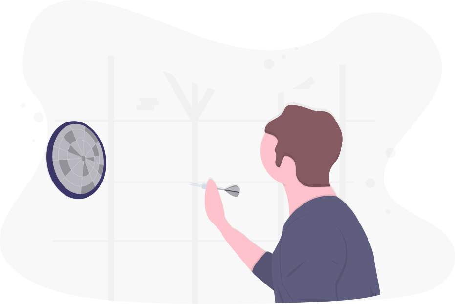

<!DOCTYPE html>
<html lang="en">
<head>
    <meta charset="UTF-8">
    <meta name="viewport" content="width=device-width, initial-scale=1.0">
    <link rel="stylesheet" href="index.css">
    <title>Pinnacle Project</title>
</head>
<body>
    
    

       <header class="flex-header">
           

           <ul class="flex-list">
               <li class="nav-flex-items routes"><a href="#">Home</a></li>
               <li class="nav-flex-items routes"><a href="#">About Us</a></li>
               <li class="nav-flex-items routes"><a href="#">Gallery</a></li>
               <li class="nav-flex-items routes"><a href="#">The Team</a></li>
               <li class="nav-flex-items routes"><a href="#">Events</a></li>
               <li class="nav-flex-items routes"><a href="#">Contact</a></li>
               <li class="nav-flex-items"><a href="#"><button class="logo-btn header-btn">DONATE</button></a></li>
           </ul>
       </header>
       <section class="image-container">
           
       </section>
       
       <section class="works">

        <header class="works-header-container">
            <h2 class="works-header">What We Do</h2>
            
We aim at boosting the recognition of Obafemi Awolowo University nationally 
            and most especially internationally by building the 'World's Largest Free Standing Alphabetical Structure'

         </header>

            

                

                    
                    <h3 class="card-header">World Recognition</h3>
                    

                        We aim to put Obafemi Awolowo University on the world map with this architectural masterpiece
                    

                

                

                    
                    <h3 class="card-header">Tourism</h3>
                    

                        We plan to further strengthen the position of Obafemi Awolowo University in 
                        being the epicentre of tourism among Nigerian institutions.
                    

                

                

                    
                    <h3 class="card-header">World Recognition</h3>
                    

                        Putting this structure in place, we hope to gain international status with this record breaking project.
                    

                

            

            <button class="logo-btn learn-more"><a href="#">Learn More</a></button>
       </section>

       <section class="so-far-container">

        <aside class="flex-aside aside-1">
            
            <!-- 
image goes here
 -->
        </aside>

        <aside class="flex-aside aside-2">
            
So close!

            <h3 class="so-close-h3">Yet So Far</h3>
            
We are set out to achieve this project soon. You can be of help.

            
            

            

                
Our Goal

                
$1,000,000

            

            
            

            
Raised

            
$1,000

            

            
            

                
Donors

                
2

            

        

        </aside>
        
       </section>

       <section class="gallery-section">

            <h2 class="gallery-h2">
                Gallery
            </h2>
           
            

                

                

                

                

            

           </section>

        <section class="team-section">
            <h2 class="team-header">
                The Team
            </h2>
            

                
            

            
        </section>

        <section class="events-section">
            <h2 class="events-header">
                Events
            </h2>

            

                
                
            

            <button class="logo-btn see-more-btn"><a href="#">See More</a></button>

        </section>
        

    

    
    

        <footer>
            

                

                    
                

                

                    We aim at building an architectural monument  that stands tall 
                    and makes Obafemi Awolowo  University different from the rest
                

                <a href="#" class="footer-links socials"><i class="fa fa-facebook fa-2x" aria-hidden="true"></i>
                </a>
                <a href="#" class="footer-links socials"><i class="fa fa-twitter fa-2x" aria-hidden="true"></i></a>
                <a href="#" class="footer-links socials"><i class="fa fa-instagram fa-2x" aria-hidden="true"></i></a>
                <a href="#" class="footer-links socials"><i class="fa fa-linkedin fa-2x" aria-hidden="true"></i></a>
            

            
            

                <h2 class="footer-heading">Explore</h2>
                <a href="" class="footer-links">About</a>
                <a href="" class="footer-links">Gallery</a>
                <a href="" class="footer-links">Events</a>
                <a href="" class="footer-links">News</a>
            

            

                <h2 class="footer-heading">Quick Links</h2>
                <a href="" class="footer-links">What We Do</a>
                <a href="" class="footer-links">Terms & Conditions</a>
                <a href="" class="footer-links">Privacy Policy</a>
            

            

                <h2 class="footer-heading">Stay In Touch</h2>
                

                    
Call Us

                    
080 000 0000

                

                

                    
Send us an email

                    
pinnacleworks@gmail.com

                

            

        </footer>

    

    
</body>
</html>
